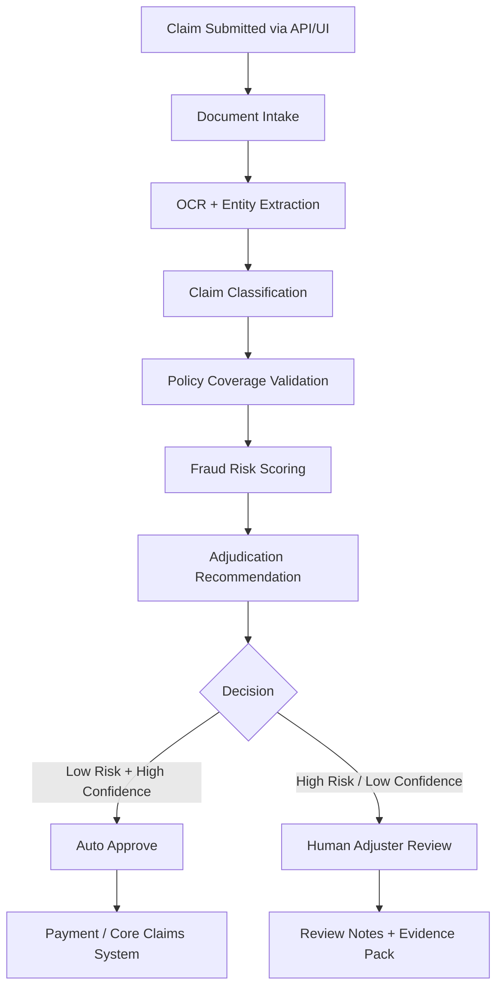
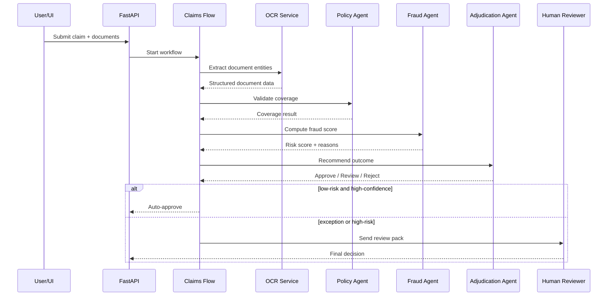

# Intelligent Claims Processing (End-to-End Automation)

A production-style starter project for an insurance **claims intake + triage + fraud risk + policy validation + adjudication recommendation** platform using:

- **FastAPI** for APIs
- **Pydantic v2** for request/response validation
- **CrewAI** concepts for multi-agent orchestration
- **Optional MCP integration** for standardized enterprise tools
- Human-in-the-loop review for high-risk or low-confidence claims

---

## 1) Business Problem

Insurance claims processing is often slowed by:
- manual document review
- missing data
- inconsistent policy interpretation
- fraud leakage
- poor prioritization of adjuster workload

This project automates the **straight-through processing** path for simple claims and routes exceptions to human adjusters.

---

## 2) Real-World Scenarios

### Scenario A — Auto glass claim (straight-through)
A customer uploads:
- claim form
- driver's license
- windshield repair invoice
- photos

System actions:
1. OCR extracts the invoice amount and vendor name
2. classification agent identifies claim type = `auto_glass`
3. policy agent validates coverage + deductible
4. fraud agent checks suspicious patterns
5. adjudication agent recommends approval
6. payment moves to downstream claims core system

### Scenario B — Water damage claim (human review)
A homeowner uploads:
- FNOL
- contractor estimate
- photos
- prior repair notes

System actions:
1. documents are parsed
2. amount is above threshold
3. fraud score is medium because vendor has repeated prior claims
4. policy wording is ambiguous for mold exclusion
5. system creates a review pack for adjuster
6. adjuster approves/denies after inspection

### Scenario C — Organized fraud ring suspicion
A clinic, towing operator, and multiple claimants appear repeatedly across claims.
System actions:
1. fraud graph detects linked entities
2. risk score increases
3. claim is auto-routed to SIU
4. all evidence is summarized for investigator

---

## 3) High-Level Architecture



---

## 4) Agentic Design

This project uses a **specialized-agent pattern**:

1. **Intake Agent**
   - validates incoming claim package
   - checks mandatory fields and attachments

2. **Document Understanding Agent**
   - performs OCR and extracts entities
   - structures receipts, estimates, and forms

3. **Policy Agent**
   - checks policy coverage, exclusions, deductible, limits

4. **Fraud Agent**
   - assigns fraud risk score
   - identifies suspicious signals and ring indicators

5. **Adjudication Agent**
   - combines all evidence
   - suggests approve / reject / review

6. **Notification / Case Pack Agent**
   - prepares claim summary for adjusters or downstream systems

---

## 5) Do We Need MCP?

### Short answer
**No, MCP is not mandatory for this solution.**
You can build the full platform using normal Python services, API clients, queues, and CrewAI tools.

### When MCP is useful
Use MCP if your enterprise wants a **standardized way** for agents to access:
- policy repository
- claims core platform
- customer profile system
- fraud investigation database
- document storage
- pricing/repair databases

### Recommendation
- **Phase 1**: Build without MCP for speed
- **Phase 2**: Introduce MCP for clean enterprise tool interoperability and governance

---

## 6) Recommended Delivery Phases

### Phase 1 — MVP
- Claim intake API
- OCR extraction
- basic fraud scoring
- coverage validation
- adjudication recommendation
- human review queue

### Phase 2 — Enterprise Hardening
- message queue / async workers
- audit logs
- monitoring
- retries
- SSO / RBAC
- model versioning

### Phase 3 — Advanced Intelligence
- graph fraud detection
- multimodal image checks
- LLM policy clause reasoning
- optional MCP servers

---

## 7) File Structure

```text
intelligent_claims_processing_project/
├── README.md
├── requirements.txt
├── .env.example
├── Dockerfile
├── docker-compose.yml
├── app/
│   ├── main.py
│   ├── config.py
│   ├── api/routes.py
│   ├── core/logging.py
│   ├── db/fake_db.py
│   ├── models/schemas.py
│   ├── services/
│   │   ├── storage_service.py
│   │   ├── ocr_service.py
│   │   ├── classification_service.py
│   │   ├── policy_service.py
│   │   ├── fraud_service.py
│   │   └── adjudication_service.py
│   ├── agents/
│   │   ├── tools.py
│   │   └── crew.py
│   ├── workflows/claims_flow.py
│   └── integrations/mcp_client.py
├── scripts/seed_sample_data.py
└── tests/test_api.py
```

---

## 8) Step-by-Step Flow

### Step 1 — Claim submission
User submits claim JSON + documents.

### Step 2 — Intake validation
System validates:
- claim number
- policy number
- claim type
- event date
- attachments

### Step 3 — OCR and extraction
Documents are parsed into structured fields:
- invoice amount
- vendor
- damage type
- date of loss
- claimant identifiers

### Step 4 — Classification
Classify claim into:
- auto
- home
- health
- travel

### Step 5 — Policy validation
Check:
- policy active?
- loss date in coverage period?
- deductible?
- exclusions?
- claim limit?

### Step 6 — Fraud scoring
Evaluate:
- repeated claimant
- repeated vendor
- suspicious timing
- large amount
- prior history
- network/ring hints

### Step 7 — Recommendation
Produce:
- decision recommendation
- confidence
- next best action
- human review flag

### Step 8 — Case packaging
Create structured output for:
- adjuster dashboard
- SIU
- payment queue
- audit trail

---

## 9) Running Locally

```bash
python -m venv .venv
source .venv/bin/activate
pip install -r requirements.txt
uvicorn app.main:app --reload
```

Then open:
- API docs: `http://127.0.0.1:8000/docs`

Run tests:
```bash
pytest -q
```

---

## 10) Sample API Request

```bash
curl -X POST http://127.0.0.1:8000/claims/process \
  -H "Content-Type: application/json" \
  -d '{
    "claim_id": "CLM-1001",
    "policy_id": "POL-2001",
    "claim_type": "auto",
    "claim_subtype": "auto_glass",
    "customer_id": "CUS-7788",
    "incident_date": "2026-03-28",
    "reported_date": "2026-03-29",
    "claim_amount": 950.0,
    "currency": "CAD",
    "description": "Windshield cracked by road debris while driving on highway.",
    "attachments": [
      {"document_id":"DOC-1","file_name":"invoice.pdf","document_type":"invoice","content":"Repair invoice from ABC Auto Glass, amount 950 CAD, service date 2026-03-28"},
      {"document_id":"DOC-2","file_name":"claim_form.txt","document_type":"claim_form","content":"Customer states windshield damage occurred on highway."}
    ]
  }'
```

---

## 11) Mermaid Sequence Diagram



---

## 12) Production Improvements

- Replace fake DB with Postgres
- Add Redis / RabbitMQ / Kafka
- Use real OCR service
- Add feature store and fraud graph model
- Add document vector search for policy wording
- Add model observability and drift monitoring
- Introduce MCP server wrappers for internal tools later
